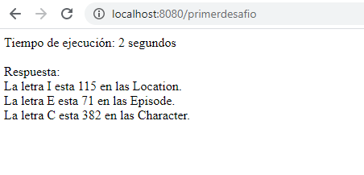

# Rick and Morty Challenge

Aplicación desarrollada en `nodejs` que consta de 2 desafios.

## Usa la API de Rick and Morty para probar tus habilidades 🥼

Tienes que consultar todos los `character`, `locations` y `episodes` de [https://rickandmortyapi.com/](https://rickandmortyapi.com/) e indicar:

1. Char counter:
    - cuántas veces aparece la letra **"l"** (case insensitive) en los nombres de todos los `location`
    - cuántas veces aparece la letra **"e"** (case insensitive) en los nombres de todos los `episode`
    - cuántas veces aparece la letra **"c"** (case insensitive) en los nombres de todos los `character`
    - cuánto tardó el programa 👆 en total (desde inicio ejecución hasta entrega de resultados)
2. Episode locations:
    - para cada `episode`, indicar la cantidad y un listado con las `location` (`origin`) de todos los `character` que aparecieron en ese `episode` (sin repetir)
    - cuánto tardó el programa 👆 en total (desde inicio ejecución hasta entrega de resultados)

## Antes de comenzar

Lo primero es descargar e instalar:

* [Visual Studio Code](https://code.visualstudio.com/)
* [nodejs](https://nodejs.org/es/download/)

Paquetes que se deben instalar en el proyecto: 

* express `npm install express`.
* request `npm install request`.
* jest `npm install --save-dev jest`.

## Desafío 1 : Char counter

Una vez ejecutada la aplicación, desde el navegador debes ingresar al localhost con el puerto por defecto configurado `8080` y llamar la ejecución del primer desafío con el enlace [http://localhost:8080/primerdesafio](http://localhost:8080/primerdesafio/)

## Desafio 2: Episode locations

Para만ntrar마l맙egundo맋esafío맙e맋ebe맓lamar맓a만jecución맋el맙egundo맋esafío맊on만l만nlace [http://localhost:8080/segundodesafio](http://localhost:8080/segundodesafio/)

## Estructura de la aplicación

1. Inicio: archivo `index.js` ubicado en la raíz.
2. Routes: carpeta para definir las rutas de la aplicación, la raíz es `./routes/`
    - `routesone.js`: ruta para el desafio 1.
    - `routestwo.js`: ruta para el desafio 2.
3. controller: Carpeta para definir los controladores, la raíz es `./controller/`
    - `callrequest.js`: controlador con 2 metodos:
        - `getdesafio1`: para llamar al desafio 1.
        - `getdesafio2`: para invocar al segundo desafío.
        - `CantPaginas`: método para leer cantidad de paginas de la llamada.
        - `CantEpisode`: método para leer la cantidad total de episodios.
    - `controllerdesafio.js`: controlador para invocar a los controllers antes definidos en loop segun la petición.
4. funciones: carpeta para definir las funciones de la aplicación, la raíz es `./function/`
5. configuración: carpeta para definir las configuraciones, la raíz es `./config/`, aqui defino el puerto a utilizar y las urls de las apirest que se van a consumir.
6. __test__: carpeta con el testing de la aplicación.

## Testing

Para ejecutar las pruebas se debe llamar al comando `npm test`, mediante `jest`.

